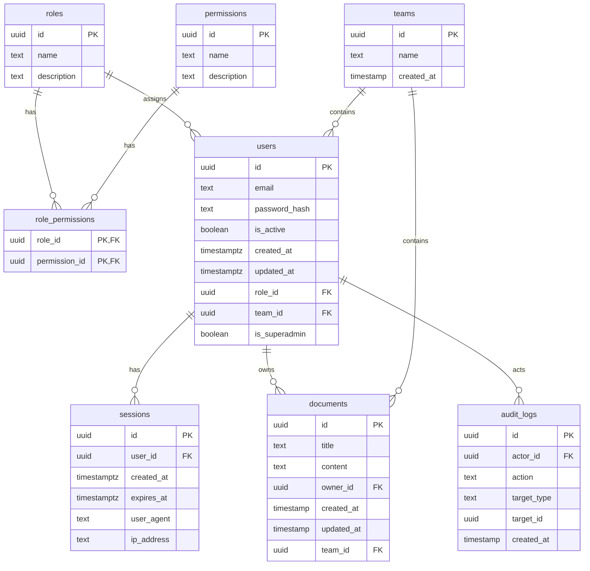

# ERD

```mermaid
erDiagram
  roles {
    uuid id PK
    text name
    text description
  }

  permissions {
    uuid id PK
    text name
    text description
  }

  role_permissions {
    uuid role_id PK, FK
    uuid permission_id PK, FK
  }

  teams {
    uuid id PK
    text name
    timestamp created_at
  }

  users {
    uuid id PK
    text email
    text password_hash
    boolean is_active
    timestamptz created_at
    timestamptz updated_at
    uuid role_id FK
    uuid team_id FK
    boolean is_superadmin
  }

  sessions {
    uuid id PK
    uuid user_id FK
    timestamptz created_at
    timestamptz expires_at
    text user_agent
    text ip_address
  }

  documents {
    uuid id PK
    text title
    text content
    uuid owner_id FK
    timestamp created_at
    timestamp updated_at
    uuid team_id FK
  }

  audit_logs {
    uuid id PK
    uuid actor_id FK
    text action
    text target_type
    uuid target_id
    timestamp created_at
  }

  roles ||--o{ role_permissions : has
  permissions ||--o{ role_permissions : has
  roles ||--o{ users : assigns
  teams ||--o{ users : contains
  users ||--o{ sessions : has
  users ||--o{ documents : owns
  teams ||--o{ documents : contains
  users ||--o{ audit_logs : acts
```
